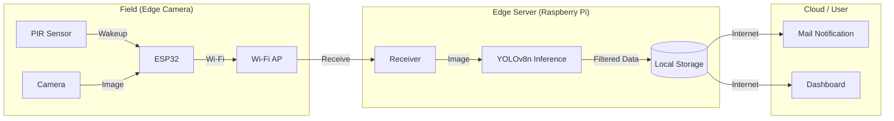

# 論文執筆計画書 (Implementation Plan)

## 概要

「鳥獣害対策のための複数台カメラを用いた低コスト通信型警戒システムの開発」に関する論文をIEICEのテンプレートを用いて執筆する。

## 文書構成案

### 1. まえがき (Introduction)

- 現状の課題: 既存のトレイルカメラの誤検知、コスト、データ回収の手間
- 本研究の目的: 安価なデバイス(ESP32, RPi)を用いた階層的システムの提案
- 貢献: 低コスト化、誤検知削減、リアルタイム通知

### 2. 提案システム (Proposed System)

- **システムアーキテクチャ**
  - Edge Camera (ESP32): 撮影、一次バッファ
  - Edge Server (RPi): 画像集約、AI推論(YOLO)、フィルタリング
  - External Server: ユーザインターフェース、通知
- **ハードウェア構成**
  - カメラ: ESP32-S3 (XIAO), PIRセンサ
  - サーバ: Raspberry Pi 4
- **ソフトウェア・通信**
  - Wi-Fi, HTTP/MQT (プロトコル確認), mDNS

### 3. 実装 (Implementation)

- **Edge Camera (ESP32)**
  - Deep Sleep制御
  - GPSによる時刻同期
  - 画像撮影とアップロードロジック
- **Edge Server (RPi)**
  - APモード設定
  - 受信サーバ (`upload_server.py`)
  - 推論エンジン (YOLOv8)
- **External Server**
  - メール通知機能
  - データ蓄積

### 4. 実験と評価 (Experiments and Evaluation)

- **エッジカメラ評価**
  - 撮影サイクルの所要時間 (起動〜撮影〜送信〜Web/Sleep)
  - 消費電力 (待機時・動作時)
- **通信性能評価**
  - エッジカメラ→エッジサーバ間の通信所要時間
  - 通信距離とエラー率の関係
- **エッジサーバ評価**
  - 消費電力・処理時間・スループット
  - YOLOv8による動物検知精度 (Precision/Recall)
  - 通信削減率 (フィルタリング効果)
- **外部サーバ評価**
  - MegaDetector等による二次判定の精度
  - 最終的な通信削減率
- **システム全体評価**
  - ユーザー通知までの総所要時間 (Latency)
  - 全体的な通信削減率 (Notification/Total Cycles)

### 6. 図版計画 (Figures and Images)

論文の説得力と可読性を高めるために、以下の図版の掲載を推奨します。

#### (1) システム全体構成図 (System Overview)

- **内容**: エッジカメラ、エッジサーバ、外部サーバの接続関係と役割を図示。
- **目的**: 読者がシステムの全体像を直感的に理解できるようにする。

#### (2) 処理フローチャート (Processing Flowchart)

- **内容**: エッジカメラの「Deep Sleep → 撮影 → 送信」のサイクルや、サーバ側の「受信 → 推論 → 選別」の流れ。
- **目的**: 省電力化の仕組みや、どのように誤検知を排除しているかを論理的に示す。

#### (3) ハードウェア外観・設置写真 (Hardware Photos)

- **内容**:
  - 製作したエッジカメラの中身（ESP32, 電池ボックス, 配線）。
  - 実際の設置風景（防水ケースに入れて木に取り付けている様子など）。
- **目的**: システムの実在性と、小型・低コストであることを視覚的にアピールする。

#### (4) 検知結果の例 (Detection Examples)

- **内容**:
  - **成功例**: 動物（シカ、イノシシ）を検出し、バウンディングボックスが付与された画像。
  - **比較例**: 昼間の画像と夜間（赤外線）の画像の比較。
  - **誤検知排除**: 風で揺れる木などが撮影されたが、YOLOで動物として検知されなかった（フィルタリングされた）例。
- **目的**: システムの有効性と誤検知削減能力を証明する。

#### (5) 実験結果のグラフ (Evaluation Graphs)

- **内容**:
  - 消費電力の推移（横軸：時間、縦軸：電流）。Deep Sleep時と通信時の差を強調。
  - 通信距離とエラー率の関係グラフ。
- **目的**: 表データよりも直感的に性能（特に省電力性）を伝える。

## 次のステップ

1. 著者情報（氏名、所属）の確認
2. 「実験と評価」のための具体的なデータ要件の洗い出し
3. コンパイル環境でのビルド確認
